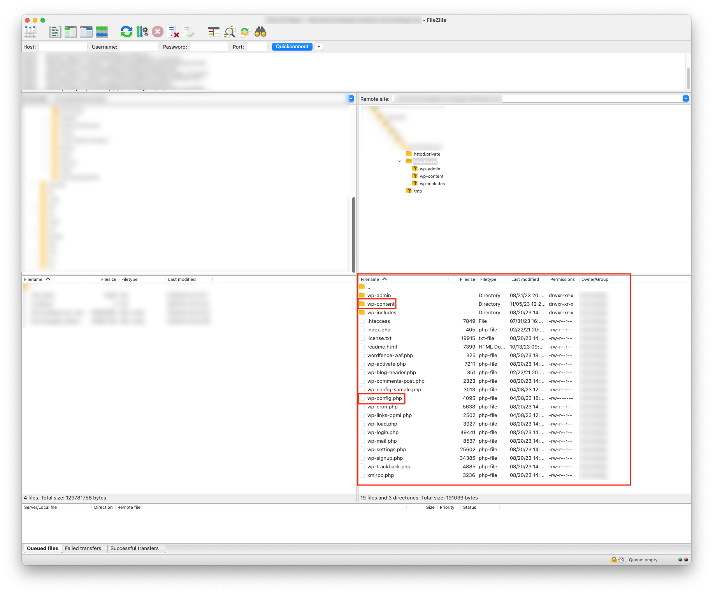
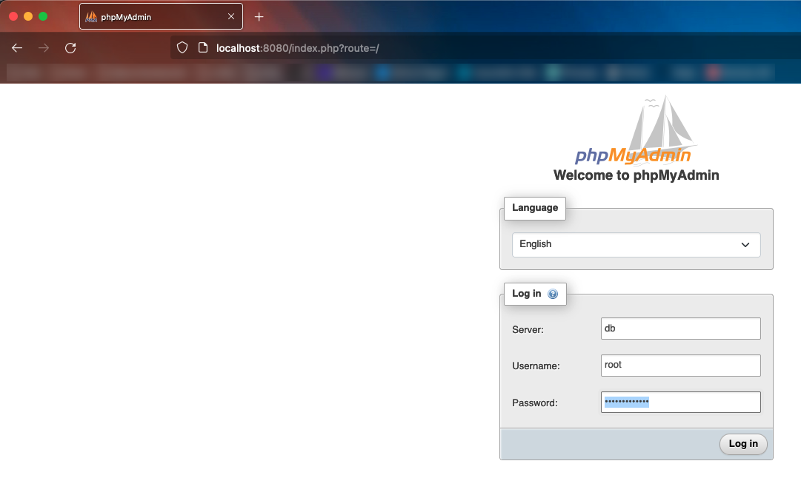
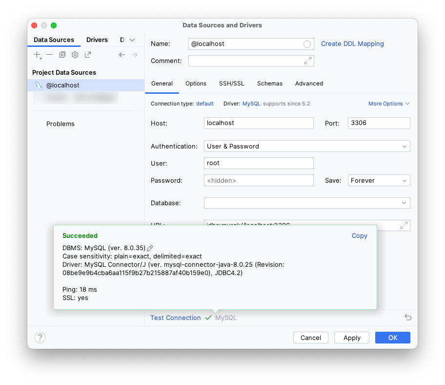
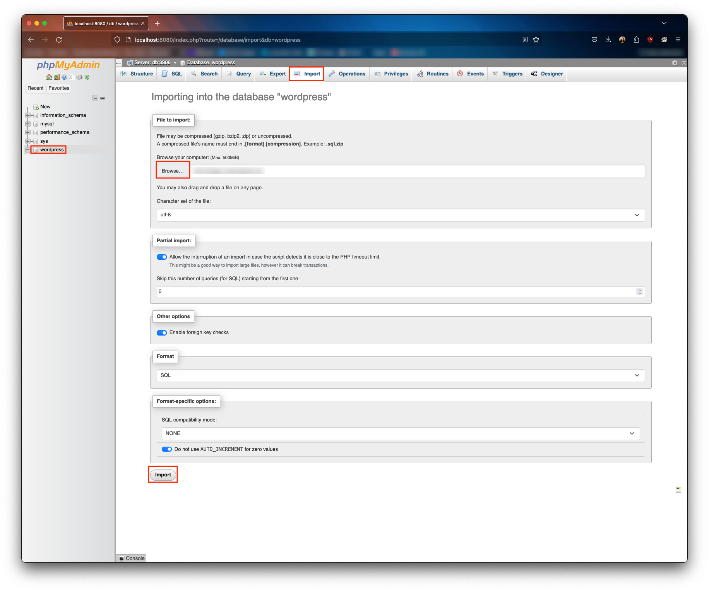

# Local Wordpress runtime using HTTPS in Docker

This step-by-step process will highlight the steps you need to perform in order to take your live-website to a docker
container for local testing, including setting up the necessary certificates to test over HTTPS.

## Pre-requisites

This guide assumes you have [Docker](https://docs.docker.com/engine/install/) and
the [Docker Compose](https://docs.docker.com/compose/install/) plugin installed, as well as
a [Docker daemon](https://docs.docker.com/config/daemon/start/) already running on your system.

## Download website content

The first step is to have a local copy of your Wordpress site's content. Most hosting providers provide your with FTP
access to your website's content. Check your control panel at your hosting provider to get access credentials.
In this example, we're using Filezilla to access and download the content.



We're interested in the following items:

* The `wp-content` folder. This contains all images, video's, etc.
* The `wp-config.php` file. This contains the configuration variables of your Wordpress website.
* If you have other custom changes made to the Wordpress installation, you may download the relevant files as well.

Depending on your site's size, this may take a while.

Your hosting provider may offer alternative ways to get access, but the main point is to download the above-outlined
folder and file.

## Download database contents

The next step is to obtain a copy of your database contents. Here, again, your hosting provider usually offers access to
your site's database through the control panel, either by providing login-details to the database, or a button to
directly connect to it through `phpMyAdmin`.
Here, we're using the `phpMyAdmin` interface. You may get access to different databases. Look for the database that
represents the `Wordpress` installation. These are usually denoted with tables having a specific prefix such as `wp_`
or `www_`.

1. Click on the database root so that the database is properly selected.
2. Navigate to the `Export` tab.
3. Optionally, tweak some settings if you want to customise the export.
4. Press the `Export` button.


Your download will be a large `.sql` file.

If you were provided with remote access details to your database, use your favorite database management tool,
e.g. `Datagrip` or `DBeaver` to extract the Wordpress data.

## Set up the local folder structure

On your system, on a location where you want the local copy of your Wordpress website to reside, create a new folder,
e.g. `MyWebsite`, and set up the file structure as shown in the diagram below. Copy the `wp-config.php` file and
the `wp-content` folder in the `Wordpress` folder. Any other files or folders in the diagram are just empty ones for
now.

```
MyWebsite
│   docker-compose.yml
│   default-ssl.conf
│   
└───Wordpress
│   │   wp-config.php -> This is the Wordpress file you downloaded earlier.
│   │
│   └───wp-content -> This is the Wordpress folder you downloaded earlier.
│       │   ...
│   
└───certs -> Empty folder.
```

## Docker compose

Open the `docker-compose.yml` file. This file will set up a `phpMyAdmin` container for database management.
If you prefer to use a different tool, such as `DataGrip` or `DBeaver`, you can leave out the `phpMyAdmin` service from
the docker compose file, and use your preferred tool later on.

```Docker
version: '3.9'

services:
  db:
    image: mysql:8.0
    container_name: "db"
    volumes:
      - db_data:/var/lib/mysql
    restart: always
    ports:
      - "3306:3306"
    environment:
      MYSQL_DATABASE: wordpress
      MYSQL_ROOT_PASSWORD: somewordpress    # Change this if you want.
      MYSQL_PASSWORD: wordpress             # Change this if you want.
      MYSQL_USER: wordpress                 # Change this if you want.
      
  phpmyadmin:
    image: phpmyadmin/phpmyadmin
    container_name: pma
    links:
      - db
    environment:
      PMA_HOST: db
      PMA_PORT: 3306
      PMA_ARBITRARY: 1
      UPLOAD_LIMIT: 50M    # Change this if your database export is larger.
    restart: always
    ports:
      - 8080:80

volumes:
  db_data:
```

In your terminal, navigate to the `MyWebsite` folder and run the following command: `docker-compose up -d`.
This will download the services and its dependencies. This step may take some time the first time you run it.

This will set up a `MySQL` database and a `phpMyAdmin` instance, which is now available in your browser by navigating to
the following address: `localhost:8080`. The compose process will also already have created a `wordpress` database in
your `MySQL` instance.

Try to connect using the credentials you've set up in the compose file.



If you're using a different database management tool, try to see if you can connect to the `MySQL` instance.

Note here that you should connect using `localhost` rather than using the name `db` (as shown above for `phpMyAdmin`),
because the name `db` is resolved by the `phpMyAdmin` container inside the internal Docker network. For your database
management program, port `3306` is already exposed the host system.



## Upload Wordpress database content

The following steps will be for when you're using `phpMyAdmin`. If you use a different database management tool, these
steps should be a general guideline of what you should do.

1. Sign in to your database with your root credentials as set up in the docker compose file.
2. Select the `wordpress` database, in the column on the left side, so that this database is active and selected.
3. Go to the Import tab.
4. Browse to the `.sql` file you got earlier from your database export.
5. Optionally, set up different import options. The defaults should be fine if your export was also left to default.
6. Import the database. Depending on the size of your file, this may take some time.



## Set up local site address and certificates

With the Wordpress site data being imported in the database, some changes to the data have to be made to reflect that
it's no longer running on the server of your hosting provider. Otherwise, some plugins or processes may redirect you
back to the live site.

To do this, you first have to decide on a local name for your site, e.g. if your live site was called `mywebsite.com`,
consider for this local version the name `mywebsite.dev`, or `mywebsite.test`. Some plugins,
like [Slider Revolution](https://www.sliderrevolution.com/faq/licensing-information-for-staging-sites-and-localhost/),
will accept the same license key if your website address has a 'development' extension.

With `phpMyAdmin` or your preferred database management tool open, set the `wordpress` database active and selected,
open up the query console, and enter the following queries:

```SQL
UPDATE www_options SET option_value = replace(option_value, 'mywebsite.com', 'mywebsite.dev') WHERE option_name = 'home' OR option_name = 'siteurl';
  
UPDATE www_posts SET post_content = replace(post_content, 'mywebsite.com', 'mywebsite.dev');
  
UPDATE www_postmeta SET meta_value = replace(meta_value,'mywebsite.com','mywebsite.dev');
```

**Note:** pay attention to the site addresses and the `www_` prefix for the tables. The prefix is one that may differ
per Wordpress install. Another common prefix is `wp_`. Update this query to reflect the prefix being used in your
Wordpress installation.

This will update the data in the tables to refer to your local website, rather than the live version.

With the database all set up, the appropriate certificates for HTTPS can be created. This is done using a tool called
[mkcert](https://github.com/FiloSottile/mkcert). When it has been downloaded and installed, enter the following command
in your terminal: `mkcert -install`. This will create a local certificate authority on your system.
After that, enter the following: `mkcert mywebsite.dev`. This will create a certificate and key file for your local
site.

Next, the `hosts` file on your system needs to be edited to direct the site address to the local ip address.
This process differs per platform:

### Windows

1. Run notepad as administrator.
2. Open the `hosts` file at `C:\Windows\System32\drivers\etc`.
3. Add the following line at the end of the file: `127.0.0.1 mywebsite.dev`
4. Save the file and close notepad.

### macOS and Linux

1. In your terminal, enter: `sudo nano /etc/hosts`.
2. Enter your password.
2. At the end of the file, add: `127.0.0.1 mywebsite.dev`.
3. Press `Ctrl + O` to save.
4. Press `Ctrl + X` to exit.

Finally, open the `default-ssl.conf` file in your project's root directory, and set its contents to the following:

```
<VirtualHost *:443>
  DocumentRoot /var/www/html
  ErrorLog ${APACHE_LOG_DIR}/error.log
  CustomLog ${APACHE_LOG_DIR}/access.log combined
  SSLEngine on
  ServerName mywebsite.dev
  SSLCertificateFile  /etc/ssl/certs/mywebsite.dev.pem
  SSLCertificateKeyFile /etc/ssl/certs/mywebsite.dev-key.pem
  <FilesMatch "\.(cgi|shtml|phtml|php)$">
          SSLOptions +StdEnvVars
  </FilesMatch>
  <Directory /usr/lib/cgi-bin>
          SSLOptions +StdEnvVars
  </Directory>
</VirtualHost>
```

This is the configuration for the underlying Apache webserver that will be used in your Wordpress container. This will
direct it to where it should look for the certificate and key files to properly handle a secure connection.

## Set up the Wordpress container

Now, let's set up the actual Wordpress container. Before doing that, let's shut down the currently running containers
using `docker-compose down` in your terminal.

Open the `wp-config.php` file, the one you downloaded in the very first step. Double check that the following parameters
match in value to those set up for the `db` service in your `docker-compose.yml` file:

* `DB_HOST` should refer to the name of the host the MySQL database is running on: `db`.
* `DB_NAME` versus `MYSQL_DATABASE`.
* `DB_USER` versus `MYSQL_USER`.
* `DB_PASSWORD` versus `MYSQL_PASSWORD`.

In the `wp-config.php` file, you should find a variable named `$table_prefix` in there that sets the table prefix.
Make sure this is set to a value that you expect as was used in updating the site address for local use, e.g. `www_`
or `wp_`.

If not already present in the `wp-config.php` file, you can add the following line as well, which will allow Wordpress
to directly interact with the filesystem, as opposed to trying to interact using FTP:

```PHP
define('FS_METHOD', 'direct');
```

Now, open the `docker-compose.yml` file again, and add the Wordpress service following to `services`:

```Docker
  wordpress:
    depends_on:
      - db
    image: wordpress:latest
    container_name: "wordpress"
    ports:
      - "443:443"
    restart: always
    environment:
      WORDPRESS_DB_HOST: db:3306
    working_dir: /var/www/html
    volumes:
      - ./Wordpress/wp-content:/var/www/html/wp-content
      - ./Wordpress/wp-config.php:/var/www/html/wp-config.php
      - ./certs:/etc/ssl/certs:ro
      - ./default-ssl.conf:/etc/apache2/sites-available/default-ssl.conf
```


With

* Update Docker compose file with Wordpress service

## Troubleshooting

* Database connection error:
    * Disable all plugins in the database:
      table `www_options`: `option_name` -> `option_value`: `active_plugins` -> `a:0:{}`