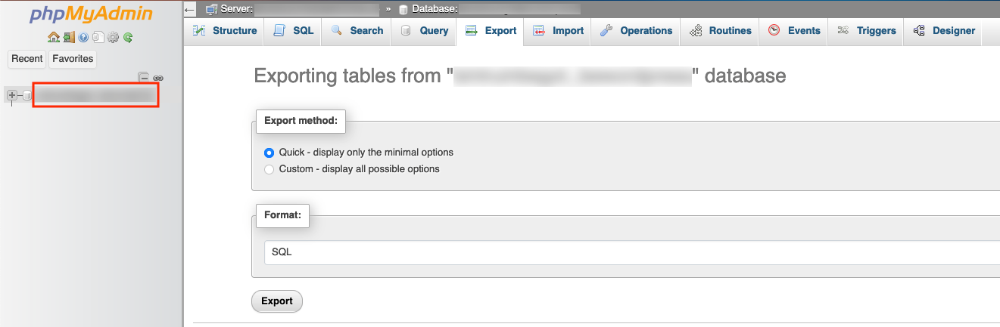

# Local WordPress development with HTTPS in Docker

This step-by-step process will guide you through taking your live website into a local Docker
container for local testing, including setting up the necessary certificates to test with HTTPS.

## Pre-requisites

1. [Docker](https://docs.docker.com/engine/install/)
2. [Docker Compose](https://docs.docker.com/compose/install/)
3. [Docker daemon](https://docs.docker.com/config/daemon/start/) should be running.
4. [mkcert](https://github.com/FiloSottile/mkcert) and a local certificate authority should've already been installed
   using `mkcert -install`.

## Downloading website content

The first step is to have a local copy of your WordPress site's content. Most hosting providers provide you with FTP
access to your website's content. Check your control panel at your hosting provider to get access credentials.
In this example, we're using Filezilla to access and download the content.


We're interested in the following items:

* The `wp-content` folder. This contains all images, video's, etc.
* The `wp-config.php` file. This contains the configuration variables of your WordPress website.
* If you have other custom changes made to the WordPress installation, you may download the relevant files as well.

Depending on your site's size, this may take a while.

Your hosting provider may offer alternative ways to get access, but the main point is to download the above-outlined
folder and file.

## Downloading database content

The next step is to obtain a copy of your WordPress database. Here, again, your hosting provider usually offers access
to your site's database through the control panel, either by providing login-details to the database server, or a button
to directly connect you to it with `phpMyAdmin`.
Here, the `phpMyAdmin` interface is used. Look for the database that represents the WordPress installation. The
database of interest is usually called `wordpress`, or the name of your site. If you're in doubt which one to select,
check the tables names. WordPress tables usually have a specific prefix, e.g. `www_` or `wp_`.

1. Click on the database root so that the database is properly selected.
2. Navigate to the Export tab.
3. Optionally, tweak some settings if you want to customise the export.
4. Press the Export button.



Your download will be a large `.sql` file.

If you were provided with remote access details to your database, use your favorite database management tool,
e.g. `Datagrip` or `DBeaver` to extract the WordPress data.

## Setting up local folder structure

On your system, on a location where you want the local copy of your WordPress website to reside, create a new folder,
e.g. `MyWebsite`, and set up the file structure as shown in the diagram below. Copy the `wp-config.php` file and
the `wp-content` folder in the `Wordpress` folder. Any other files or folders in the diagram are just empty ones for
now.

```
MyWebsite
│   docker-compose.yml
│   default-ssl.conf
│   
└───Wordpress
│   │   wp-config.php -> This is the Wordpress file you downloaded earlier.
│   │
│   └───wp-content -> This is the Wordpress folder you downloaded earlier.
│       │   ...
│   
└───certs -> Empty folder.
```

## Docker compose

Open the `docker-compose.yml` file. This file will set up a `phpMyAdmin` container for database management.
If you prefer to use a different tool, such as `DataGrip` or `DBeaver`, you can leave out the `phpMyAdmin` service from
the Docker compose file, and use your preferred tool later on.

```Docker
version: '3.9'

services:
  db:
    image: mysql:8.0
    container_name: "db"
    volumes:
      - db_data:/var/lib/mysql
    restart: always
    ports:
      - "3306:3306"
    environment:
      MYSQL_DATABASE: wordpress
      MYSQL_ROOT_PASSWORD: somewordpress    # Change this if you want.
      MYSQL_PASSWORD: wordpress             # Change this if you want.
      MYSQL_USER: wordpress                 # Change this if you want.
      
  phpmyadmin:
    image: phpmyadmin/phpmyadmin
    container_name: pma
    links:
      - db
    environment:
      PMA_HOST: db
      PMA_PORT: 3306
      PMA_ARBITRARY: 1
      UPLOAD_LIMIT: 50M    # Change this if your database export is larger.
    restart: always
    ports:
      - 8080:80

volumes:
  db_data:
```

In your terminal, navigate to the `MyWebsite` folder and run the following command:

```Shell
docker compose up -d
```

This will download the services and its dependencies. It may take some time the first time you run it. This will set up
a `MySQL` database and a `phpMyAdmin` instance, which should be available in your browser after it has done downloading
and starting the containers.
Navigate to the following address in your web browser: `localhost:8080`. The compose process will also have
created a `wordpress` database in your `MySQL` instance.

Try to connect using the credentials you've set up in the compose file.


If you're using a different database management tool, try to see if you can connect to the `MySQL` instance.

Note here that you should connect using `localhost` rather than using the name `db` (as shown above for `phpMyAdmin`),
because the name `db` is resolved by the `phpMyAdmin` container inside the internal Docker network. For your database
management program, port `3306` is already exposed the host system.


## Uploading WordPress database content

The following steps will be for when you're using `phpMyAdmin`. If you use a different database management tool, these
steps should be a general guideline of what you should do.

1. Sign in to your database with your root credentials as set up in the Docker compose file.
2. Select the `wordpress` database, in the column on the left side, so that this database is active and selected.
3. Go to the Import tab.
4. Browse to the `.sql` file you got earlier from your database export.
5. Optionally, set up different import options. The defaults should be fine if your export was also left to default.
6. Import the database. Depending on the size of your file, this may take some time.


## Setting up local site address and certificates

With the WordPress site data imported in the database, some changes to the data have to be made to reflect that
it's no longer running on the server of your hosting provider. Otherwise, some plugins or processes may redirect you
back to the live site.

To do this, you first have to decide on a local name for your site, e.g. if your live site was called `mywebsite.com`,
consider for this local version `mywebsite.dev`, or `mywebsite.test`. Some plugins,
like [Slider Revolution](https://www.sliderrevolution.com/faq/licensing-information-for-staging-sites-and-localhost/),
will accept the same license key if your website address has a 'development' extension.

With `phpMyAdmin` or your preferred database management tool open, set the `wordpress` database active and selected,
open up the query console, and enter the following queries:

```SQL
UPDATE www_options SET option_value = replace(option_value, 'mywebsite.com', 'mywebsite.dev') WHERE option_name = 'home' OR option_name = 'siteurl';
  
UPDATE www_posts SET post_content = replace(post_content, 'mywebsite.com', 'mywebsite.dev');
  
UPDATE www_postmeta SET meta_value = replace(meta_value,'mywebsite.com','mywebsite.dev');
```

This will update the data in the tables to refer to your local website, rather than the live version.

**Note:** pay attention to the site addresses and the `www_` prefix for the tables. The prefix is one that may differ
per WordPress install. Another common prefix is `wp_`. Update this query to reflect the prefix being used in your
WordPress installation.

With the database all set up, the appropriate certificates for HTTPS can be created. Navigate to the `certs` folder in
your project's root directory, and enter the following command:

```Shell
mkcert mywebsite.dev
```

This will create a certificate and a key file for your local site.

Next, the `hosts` file on your system needs to be edited to resolve the site address to the local ip address.
This process differs per platform:

### Windows

1. Run notepad as administrator.
2. Open the `hosts` file at `C:\Windows\System32\drivers\etc`.
3. Add the following line at the end of the file: `127.0.0.1 mywebsite.dev`
4. Save the file and close notepad.

### macOS and Linux

1. In your terminal, enter: `sudo nano /etc/hosts`.
2. Enter your password.
3. At the end of the file, add: `127.0.0.1 mywebsite.dev`.
4. Press `Ctrl + O` to save.
5. Press `Ctrl + X` to exit.

Finally, open the `default-ssl.conf` file in your project's root directory, set its contents to the following,
and edit it to match your local site address:

```
<VirtualHost *:443>
  DocumentRoot /var/www/html
  ErrorLog ${APACHE_LOG_DIR}/error.log
  CustomLog ${APACHE_LOG_DIR}/access.log combined
  SSLEngine on
  ServerName mywebsite.dev
  SSLCertificateFile  /etc/ssl/certs/mywebsite.dev.pem
  SSLCertificateKeyFile /etc/ssl/certs/mywebsite.dev-key.pem
  <FilesMatch "\.(cgi|shtml|phtml|php)$">
          SSLOptions +StdEnvVars
  </FilesMatch>
  <Directory /usr/lib/cgi-bin>
          SSLOptions +StdEnvVars
  </Directory>
</VirtualHost>
```

This is the configuration for the underlying Apache webserver that will be used in your WordPress container, and will
direct it to where it should look for the certificate and key files to properly handle a secure connection.

## Setting up WordPress container

Open the `wp-config.php` file, the one you downloaded in the very first step. Double check that the following parameters
in the file match in value to those set up for the `db` service in your `docker-compose.yml` file:

* `DB_HOST` should refer to the name of the host the MySQL database is running on: `db`.
* `DB_NAME` versus `MYSQL_DATABASE`.
* `DB_USER` versus `MYSQL_USER`.
* `DB_PASSWORD` versus `MYSQL_PASSWORD`.

In the `wp-config.php` file, you should find a variable named `$table_prefix` in there that sets the table prefix.
Make sure this corresponds to a value that you expect as was used in updating the site address for local use,
e.g. `www_` or `wp_`.

Now, with the `docker-compose.yml` file open, add WordPress to `services`:

```Docker
  wordpress:
    depends_on:
      - db
    image: wordpress:latest     # Either use the latest version, or the version of your live site.
    container_name: "wordpress"
    ports:
      - "443:443"
    restart: always
    environment:
      WORDPRESS_DB_HOST: db:3306
    working_dir: /var/www/html
    volumes:
      - ./Wordpress/wp-content:/var/www/html/wp-content
      - ./Wordpress/wp-config.php:/var/www/html/wp-config.php
      - ./certs:/etc/ssl/certs:ro
      - ./default-ssl.conf:/etc/apache2/sites-available/default-ssl.conf
```

With WordPress added to the compose file, rebuild and start the WordPress container:

```Shell
docker compose up --build -d
```

If your terminal is not back already in your project's root directory, navigate to it now.
Copy out the `docker-entrypoint.sh` file from the `wordpress` container, so that it can be modified:

```Shell
docker cp wordpress:/usr/local/bin/docker-entrypoint.sh docker-entrypoint.sh
```

Open this file in your text editor, and replace the final line of the file with the following:

```Shell
a2enmod ssl
a2ensite default-ssl
service apache2 restart
service apache2 stop
exec "$@"
```

This will enable the `ssl` module in the Apache webserver and will direct it to use the configuration that
was set up earlier.

Save and close the file. Open the Docker compose file again and add the following volume mapping for the `wordpress`
service:

```Docker
- ./docker-entrypoint.sh:/usr/local/bin/docker-entrypoint.sh:ro
```

That should be all! Now, rebuild again and your website should be up and running! A full copy of
the `docker-compose.yml` file can be found [here](./docker-compose.yml).

```Shell
docker compose up --build -d
```

In your web browser, navigate to your local webpage and notice that it's using HTTPS. Success!


## Troubleshooting

Some issues might pop up because your site is now running on a different address than it was before.

### Slow loading

Your hosting provider may have set up some PHP parameters that are optimised for loading web pages. You can adjust
several parameters yourself by adding additional configuration files and mapping them to the WordPress container's
PHP config directory. Some personal settings I have applied are included below:

* A `wordpress.ini` file:

```Ini
max_input_vars = 5000
max_execution_time = 300
post_max_size = 50M
upload_max_filesize = 50M
```

* A `uploads.ini` file:

```Ini
file_uploads = On
memory_limit = 64M
upload_max_filesize = 64M
post_max_size = 64M
max_execution_time = 600
```

Map the files in the `wordpress` service's volumes:

```Docker
- ./Wordpress/uploads.ini:/usr/local/etc/php/conf.d/uploads.ini
- ./Wordpress/wordpress.ini:/usr/local/etc/php/conf.d/wordpress.ini
```

Rebuild, and restart your containers.

### Signing in

Note that signing in through `wp-admin` still needs to be done using the original e-mail addresses. If your site's
administrators signed up with addresses such as `user@mywebsite.com`.
In [this section](#setting-up-local-site-address-and-certificates),
only content links, meta-data and the site's url were changed. User credentials and login information should've remained
the same.

### Database connection error

In some cases, plugins and themes may store data that references to the live site's address still, which can show up as
database connection errors. This can get fixed by disabling all plugins through updating a database value. You can enter
the following SQL query (note the table prefix again):

```SQL
UPDATE www_options
SET option_value = "a:0:{}"
WHERE option_name = "active_plugins";
```

Going into the plugins section of your administrator page, you can start activating them again one by one, to see if
any particular plugin is causing trouble. You may have to delve into its stored data to see if you need to update
some additional values or settings.

### WordPress asks for FTP credentials

By default, WordPress will try to work using FTP to manage files on the host system. This is cumbersome and not
efficient. To let WordPress use the file system directly, add the following to your `wp-config.php` file:

```PHP
define('FS_METHOD', 'direct');
```